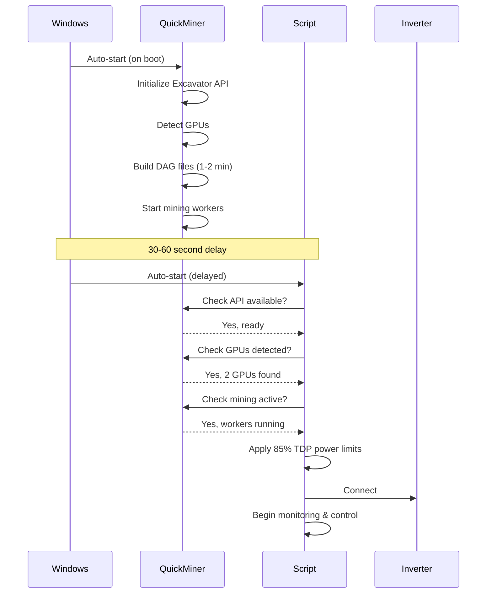

# Autostart Guide - Solar Mining System

## Choose Your Platform

This system supports autostart on multiple platforms:

### 🪟 Windows
**See: [WINDOWS_AUTOSTART_GUIDE.md](WINDOWS_AUTOSTART_GUIDE.md)**

Covers:
- Windows Startup Folder setup
- Task Scheduler configuration  
- QuickMiner + Script synchronization
- Intelligent startup wait (up to 2 minutes)
- Troubleshooting Windows-specific issues

**Key Feature**: Script automatically waits for QuickMiner to fully start and begin mining before taking control.

### 🐧 Linux (Raspberry Pi)
**See: Installation scripts and systemd setup**

Use the provided installation scripts:
```bash
./setup_raspberry.sh
```

This creates systemd service that auto-starts on boot.

## Quick Start (Windows)

### Prerequisites
1. QuickMiner installed and configured
2. Solar mining script installed
3. `nhqm.conf` file with API token

### Basic Setup (2 methods)

**Method 1: Simple Startup Folder** (Quick but less reliable)
1. Press `Win + R`, type `shell:startup`
2. Create shortcut to `start_solar_mining.bat`
3. Create shortcut to QuickMiner
4. Reboot and test

**Method 2: Task Scheduler** (Recommended)
1. QuickMiner auto-start via its settings OR startup folder
2. Create Task Scheduler task for script with 30-60 second delay
3. Script's built-in wait handles the rest
4. Reboot and test

See [WINDOWS_AUTOSTART_GUIDE.md](WINDOWS_AUTOSTART_GUIDE.md) for detailed steps.

## How It Works

### Startup Sequence



### Intelligent Wait System

The script includes a smart wait function that:

1. **Checks every 5 seconds** for QuickMiner status
2. **Waits up to 2 minutes** (configurable) for full startup
3. **Verifies 5 stages**:
   - ✅ QuickMiner process running
   - ✅ Excavator API responding
   - ✅ GPUs detected
   - ✅ DAG files built
   - ✅ Workers actively mining

4. **Shows progress**:
   ```
   ⏳ [0s] Waiting for QuickMiner API...
   ✅ [15s] QuickMiner API available (Excavator v1.9.7.0)
   ✅ [18s] GPUs detected: 0: RTX 5060 Ti, 1: GTX 1070 Ti
   ⏳ [25s] Workers exist but not mining yet (DAG building?)...
   ✅ [95s] Mining active: GPU0:kawpow, GPU1:kawpow
   ```

5. **Continues even on timeout** (with warning)

### Safety Features at Startup

Once QuickMiner is ready:

1. **Power limits applied** - 85% TDP by default
2. **Thermal monitoring starts** - Checks every 60 seconds
3. **Inverter connection** - With unlimited retry
4. **Solar monitoring begins** - 30-second intervals
5. **Smart control active** - Start/stop based on solar power

## Configuration

### Adjust Wait Time

If your system is slow or has many GPUs:

```python
# In solar_mining_api.py or via environment variable
QUICKMINER_STARTUP_WAIT = 180  # 3 minutes instead of 2
```

Environment variable:
```bash
set QUICKMINER_STARTUP_WAIT=180
```

### Startup Delay

Recommended delays:
- **Startup Folder**: Add 30-60 second delay to batch file
- **Task Scheduler**: Configure 30-60 second trigger delay
- **Script Wait**: Default 120 seconds (configurable)

**Total**: ~2-3 minutes from Windows login to fully operational

## Verification

After configuring autostart:

1. **Reboot Windows**
2. **Observe startup**:
   - QuickMiner window appears first
   - Script window appears ~30-60 seconds later
   - Script shows "Waiting for QuickMiner" messages
   - Script confirms "QuickMiner fully started and mining"
   - Script applies power limits
   - Script connects to inverter
   - Monitoring begins

3. **Check logs**:
   ```bash
   # Check startup sequence
   type logs\errors.log | findstr "QuickMiner\|startup\|waiting"
   
   # Check if power limits were applied
   type logs\errors.log | findstr "power limit"
   ```

4. **Verify operation**:
   - Mining should stop when solar power is insufficient
   - Mining should start when solar power is available
   - Power limits should be at 85% TDP
   - Thermal monitoring should be active

## Troubleshooting

### Script Starts Before QuickMiner
→ Add 30-60 second startup delay  
→ See: [WINDOWS_AUTOSTART_GUIDE.md](WINDOWS_AUTOSTART_GUIDE.md#script-starts-before-quickminer)

### QuickMiner Doesn't Auto-Start Mining
→ Enable "Start mining when QuickMiner starts" in settings  
→ See: [WINDOWS_AUTOSTART_GUIDE.md](WINDOWS_AUTOSTART_GUIDE.md#quickminer-doesnt-auto-start-mining)

### Script Times Out Waiting
→ Increase `QUICKMINER_STARTUP_WAIT` to 180-300 seconds  
→ Check QuickMiner logs for errors  
→ See: [WINDOWS_AUTOSTART_GUIDE.md](WINDOWS_AUTOSTART_GUIDE.md#script-times-out-waiting-for-quickminer)

### Both Run But Don't Interact
→ Check API port (18000) is accessible  
→ Verify `nhqm.conf` auth token is correct  
→ Review `logs/errors.log` for API errors

## Platform-Specific Guides

- **Windows**: [WINDOWS_AUTOSTART_GUIDE.md](WINDOWS_AUTOSTART_GUIDE.md) - Complete Windows setup
- **Raspberry Pi**: [QUICKSTART_PI.md](QUICKSTART_PI.md) - Pi monitoring setup
- **General**: [README.md](README.md) - Main documentation

## Summary

✅ Script intelligently waits for QuickMiner startup (up to 2 minutes)  
✅ Verifies mining is active before taking control  
✅ Applies power limits immediately (85% TDP default)  
✅ Survives Windows reboots with proper configuration  
✅ Handles timing issues automatically  
✅ Provides detailed startup feedback  
✅ Continues operation even if QuickMiner delays  

**Recommended**: Use Task Scheduler with 30-60 second delay for most reliable autostart.
